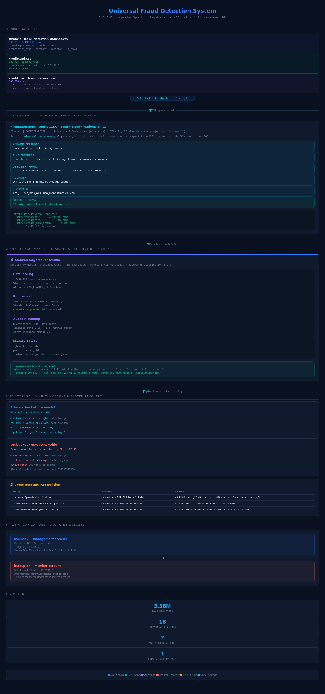

# Universal Fraud Detection System — AWS EMR + SageMaker + Multi-Account DR

> End-to-end ML pipeline processing **5.38M+ transactions** across **3 heterogeneous datasets** using a single unified XGBoost model and real-time SageMaker inference endpoint, with cross-account disaster recovery in a separate AWS region.


---


<details>
<summary>📋 ASCII Architecture (text fallback)</summary>

```
┌─────────────────────────────────────────────────────────────────────────┐
│                    ACCOUNT A — babindev (557270420072)                  │
│                           us-east-1  N. Virginia                       │
│                                                                         │
│  ┌──────────────┐    ┌──────────────────────────────────────────────┐   │
│  │  Input Data  │    │           Amazon EMR (emr-7.12.0)            │   │
│  │  S3 bucket   │───▶│  Spark 3.5.6 · 1 Primary + 2 Core (m4.xl)  │   │
│  │              │    │  universal_feature_eng_v2.py                 │   │
│  │ 3 CSV files  │    │  18 universal features · 5.38M rows output  │   │
│  └──────────────┘    └──────────────────┬───────────────────────────┘   │
│                                         │ Parquet                       │
│                                         ▼                               │
│                      ┌──────────────────────────────────────────────┐   │
│                      │      output_data/universal-features/         │   │
│                      │  source=financial/ · creditcard/ · cc_fraud/ │   │
│                      └──────────────────┬───────────────────────────┘   │
│                                         │                               │
│                                         ▼                               │
│                      ┌──────────────────────────────────────────────┐   │
│                      │         Amazon SageMaker Studio              │   │
│                      │  universal_fraud_training.ipynb              │   │
│                      │  XGBoost · SKLearnModel · inference.py       │   │
│                      │  universal-fraud-endpoint (ml.t2.medium)     │   │
│                      └──────────────────┬───────────────────────────┘   │
│                                         │                               │
│            ┌────────────────────────────┼──────────────────────┐        │
│            │ Primary S3                 │                       │        │
│            │ models/universal-fraud-xgb/│                       │        │
│            │ results/universal-fraud-xgb│                       │        │
│            └────────────────────────────┘                       │        │
└─────────────────────────────────────────────────────────────────┼────────┘
                                Cross-account IAM policy           │
                                                                   ▼
┌─────────────────────────────────────────────────────────────────────────┐
│                   ACCOUNT B — backup-dr (337023347358)                  │
│                           us-east-2  Ohio  (DR Region)                 │
│                                                                         │
│                ┌─────────────────────────────────────────────┐          │
│                │          fraud-detection-dr (S3)            │          │
│                │  Versioning ON · SSE-S3 · Block public      │          │
│                │  models/ · results/ · output_data/          │          │
│                └─────────────────────────────────────────────┘          │
└─────────────────────────────────────────────────────────────────────────┘
```

</details>

---

## Repository Structure

```
fraud-detection-aws/
│
├── README.md                          ← This file
├── .gitignore
│
├── emr/                               ← PySpark feature engineering
│   ├── universal_feature_eng_v2.py    ← Main script (optimised)
│   └── universal_feature_eng_v1.py    ← Original version
│
├── sagemaker/                         ← Jupyter notebooks
│   ├── universal_fraud_training.ipynb ← Universal model (3 datasets)
│   └── cc_fraud_training.ipynb        ← Single dataset baseline
│
├── iam/                               ← IAM policy JSON files
│   ├── dr_bucket_policy.json          ← Bucket policy for fraud-detection-dr
│   └── emr_cross_account_policy.json  ← Inline policy on EMR_EC2_DefaultRole
│
├── scripts/
│   └── predict.py                     ← CLI inference script
│
├── docs/
│   └── architecture.html             ← (reserved for future use)
│
├── architecture_preview.png          ← Static preview rendered in this README
├── fraud_detection_pictorial.html    ← Interactive architecture (GitHub Pages)
│
└── data/
    └── README.md                      ← S3 dataset paths reference
```

---

## Tech Stack

| Layer | Technology | Version |
|---|---|---|
| Distributed compute | Amazon EMR | 7.12.0 |
| Processing engine | Apache Spark | 3.5.6 |
| ML training | Amazon SageMaker | Studio |
| Algorithm | XGBoost | 1.2-1 |
| Inference | SKLearnModel + inference.py | framework 1.2-1 |
| Storage — primary | Amazon S3 | us-east-1 |
| Storage — DR | Amazon S3 | us-east-2 |
| Multi-account | AWS Organizations | o-n3jw25ozb1 |
| Language | Python | 3.10 |
| Key libs | pandas, scikit-learn, s3fs, pyarrow, boto3 | — |

---

## Datasets

All raw data is stored in S3 — **not committed to this repo** (see `data/README.md`).

| Dataset | Size | Rows | Key columns |
|---|---|---|---|
| financial_fraud_detection_dataset.csv | 759 MB | 5,000,000 | timestamp · amount · sender_account · is_fraud |
| creditcard.csv | 143 MB | 284,807 | Time · V1–V28 (PCA) · Amount · Class |
| credit_card_fraud_dataset.csv | Variable | 100,000 | TransactionDate · MerchantID · IsFraud |
| mixed_fraud_test_dataset_1M.csv | 175 MB | 1,000,000 | Synthetic mixed-schema test set · 6% fraud |

---

## Universal Feature Schema (18 columns)

The EMR job maps all 3 datasets to a common 18-feature schema:

| Group | Features |
|---|---|
| Amount | `log_amount` · `amount_z` · `is_high_amount` |
| Time | `hour` · `hour_sin` · `hour_cos` · `is_night` · `day_of_week` · `is_weekend` · `txn_month` |
| User behaviour | `user_mean_amount` · `user_std_amount` · `user_txn_count` · `user_amount_z` |
| Velocity | `txn_count_5m` |
| PCA magnitude | `pca_l2` · `pca_max_abs` · `pca_mean` |

---

## Getting Started

### Prerequisites

```bash
pip install xgboost scikit-learn pyarrow s3fs pandas numpy boto3 sagemaker
```

AWS CLI configured with appropriate IAM permissions.

### Step 1 — Run EMR Feature Engineering

Upload the script to S3 and submit as an EMR step:

```bash
# Upload script
aws s3 cp emr/universal_feature_eng_v2.py \
  s3://databucket-fraud-detection/jobs/universal_feature_eng_v2.py

# Submit step to running cluster
aws emr add-steps \
  --cluster-id <YOUR_CLUSTER_ID> \
  --steps Type=Spark,Name="UniversalFeatureEng",ActionOnFailure=CONTINUE,\
Args=[--deploy-mode,cluster,\
s3://databucket-fraud-detection/jobs/universal_feature_eng_v2.py,\
--ds1,s3://databucket-fraud-detection/input_data/financial_fraud_detection_dataset.csv,\
--ds2,s3://databucket-fraud-detection/input_data/creditcard.csv,\
--ds3,s3://databucket-fraud-detection/input_data/credit_card_fraud_dataset.csv,\
--output_uri,s3://databucket-fraud-detection/output_data/universal-features/] \
  --region us-east-1
```

Expected output partitions after completion:
```
s3://databucket-fraud-detection/output_data/universal-features/
  ├── source=financial/
  ├── source=creditcard/
  └── source=credit_card_fraud/
```

### Step 2 — Train & Deploy in SageMaker

1. Open `sagemaker/universal_fraud_training.ipynb` in SageMaker Studio
2. Run **Kernel → Restart & Run All**
3. Notebook trains XGBoost on 1.5M rows and deploys `universal-fraud-endpoint`

### Step 3 — Predict on Any New Dataset

```bash
# Using the CLI script
python scripts/predict.py \
  --csv s3://databucket-fraud-detection/input_data/creditcard.csv \
  --amount_col Amount \
  --time_col Time \
  --time_is_numeric \
  --output s3://databucket-fraud-detection/results/predictions/creditcard_out.csv
```

Or from within the notebook:

```python
results = predict_any_csv(
    's3://your-bucket/new_data.csv',
    amount_col = 'Amount',
    time_col   = 'timestamp',
    user_col   = 'sender_account'
)
```

---

## AWS Infrastructure

### EMR Cluster Configuration

| Setting | Value |
|---|---|
| Version | emr-7.12.0 |
| Applications | Spark 3.5.6 · Hadoop 3.4.1 · Hive 3.1.3 |
| Primary node | m4.xlarge |
| Core nodes | 2 × m4.xlarge |
| YARN memory | 12,288 MB per node |
| VPC | emr-project-vpc (10.0.0.0/16) |

YARN memory reconfiguration (fixes AM memory threshold error):

```json
[
  {
    "Classification": "yarn-site",
    "Properties": {
      "yarn.nodemanager.resource.memory-mb": "12288",
      "yarn.scheduler.maximum-allocation-mb": "12288"
    }
  }
]
```

### SageMaker Endpoint

| Setting | Value |
|---|---|
| Endpoint name | `universal-fraud-endpoint` |
| Framework | SKLearnModel 1.2-1 |
| Instance | ml.t2.medium |
| Content type | application/json |
| Input | List of feature dicts |
| Output | `{ predictions: [...], probabilities: [...] }` |

### Cross-Account DR Setup

Apply `iam/emr_cross_account_policy.json` as an inline policy on `EMR_EC2_DefaultRole` in Account A.

Apply `iam/dr_bucket_policy.json` as the bucket policy on `fraud-detection-dr` in Account B.

```bash
# Account A — attach inline policy to EMR role
aws iam put-role-policy \
  --role-name EMR_EC2_DefaultRole \
  --policy-name CrossAccountDRAccess \
  --policy-document file://iam/emr_cross_account_policy.json

# Account B — apply bucket policy (run with Account B credentials)
aws s3api put-bucket-policy \
  --bucket fraud-detection-dr \
  --policy file://iam/dr_bucket_policy.json \
  --profile account-b
```

---

## S3 Bucket Structure

### Primary — databucket-fraud-detection (us-east-1)

```
databucket-fraud-detection/
├── input_data/                              ← Raw CSV datasets
│   ├── financial_fraud_detection_dataset.csv
│   ├── creditcard.csv
│   ├── credit_card_fraud_dataset.csv
│   └── mixed_fraud_test_dataset_1M.csv
├── jobs/                                    ← PySpark scripts
│   └── universal_feature_eng_v2.py
├── output_data/
│   └── universal-features/                  ← EMR Parquet output
│       ├── source=financial/
│       ├── source=creditcard/
│       └── source=credit_card_fraud/
├── models/
│   └── universal-fraud-xgb/
│       └── model.tar.gz                     ← Packaged model artifacts
├── results/
│   └── universal-fraud-xgb/
│       ├── metrics.json
│       ├── feature_names.joblib
│       └── predictions/                     ← Per-dataset prediction CSVs
└── emr_cluster_logs/                        ← EMR step logs
```

### DR — fraud-detection-dr (us-east-2)

```
fraud-detection-dr/
├── models/
│   └── universal-fraud-xgb/
│       └── model.tar.gz
├── results/
│   └── universal-fraud-xgb/
│       └── metrics.json
└── output_data/                             ← EMR features backup
```

---

## Key Technical Challenges Resolved

| Challenge | Root Cause | Fix |
|---|---|---|
| YARN AM memory exceeded | Default max 1,792 MB < required 1,878 MB | Reconfigured yarn-site to 12,288 MB |
| CSV read took 2+ hours | 759 MB loaded into 1 partition | Added `.repartition(200)` immediately after `spark.read.csv()` |
| `percent_rank()` OOM | Full-dataset sort on large data | Replaced with `percentile_approx()` |
| Kernel crash (OOM) | Loading 5.38M rows (1 GB) into ml.t3.medium | Sample to 1.5M rows |
| Endpoint health check failure | XGBoostModel container missing xgboost module | Switched to SKLearnModel with joblib artifacts |
| Cross-account Access Denied | SageMaker role not in DR bucket policy | Added second Principal to bucket policy |
| SageMaker pip install failed | Studio in VPC-Only mode, no internet | Recreated domain with Public Internet access |
| Windows SSH key permissions | UNPROTECTED PRIVATE KEY FILE | Used `icacls` to strip inherited permissions |

---

## AWS Organizations Setup

```
Root (o-n3jw25ozb1)
├── babindev — Management account
│   ID: 557270420072 · us-east-1
│   EMR_EC2_DefaultRole
│   AmazonSageMaker-ExecutionRole-20260217T071318
│
└── backup-dr — Member account
    ID: 337023347358 · us-east-2
    OrganizationAccountAccessRole (auto-created)
```

Switch into the DR account from the AWS console:

```
Account dropdown → Switch Role
Account: 337023347358
Role:    OrganizationAccountAccessRole
```

---

## Resume Bullets

- Architected an end-to-end universal fraud detection ML pipeline on AWS processing **5.38M+ transactions** across **3 heterogeneous datasets** using PySpark on Amazon EMR (emr-7.12.0, Spark 3.5.6) and XGBoost on Amazon SageMaker, achieving real-time inference via a single unified SKLearnModel endpoint.

- Designed a universal PySpark feature engineering framework extracting **18 features** — amount statistics, temporal signals, user behavioural aggregations, 5-minute velocity buckets, and PCA magnitude features — unifying 3 disparate schemas into a common Parquet output partitioned by source.

- Implemented cross-account disaster recovery using **AWS Organizations**, provisioning a member account (backup-dr, 337023347358) in us-east-2 and automating model artifact replication via cross-account IAM bucket policies.

- Resolved critical production failures: YARN AM memory threshold violations, single-partition CSV bottlenecks causing 2+ hour hangs, SageMaker kernel OOM crashes, endpoint health check failures, and VPC network unreachable errors.

- Deployed a **real-time SageMaker endpoint** with a universal `predict_any_csv()` utility enabling zero-retraining fraud scoring on any new CSV dataset format.

---

## Project Metrics

| Metric | Value |
|---|---|
| Total rows processed | 5,384,807 |
| Universal feature dimensions | 18 |
| Training sample | 1,500,000 rows |
| EMR cluster | 1 Primary + 2 Core (m4.xlarge) |
| YARN memory | 12,288 MB/node (reconfigured) |
| Endpoint | universal-fraud-endpoint (ml.t2.medium) |
| AWS accounts | 2 (management + DR member) |
| DR region | us-east-2 (Ohio) |
| Synthetic test dataset | 1M rows · 175 MB · 6% fraud |

---

## Author

**Debopriyo Roy**
Cloud & DevOps Engineer · MASc Computer Engineering, Memorial University of Newfoundland
GitHub: [DebopriyoRoy](https://github.com/DebopriyoRoy)
